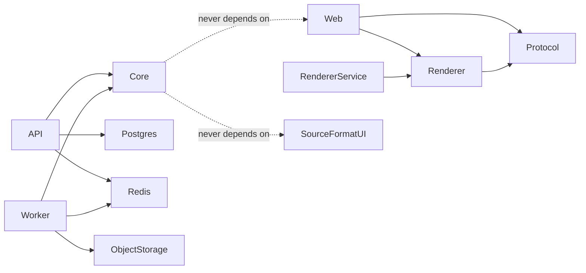
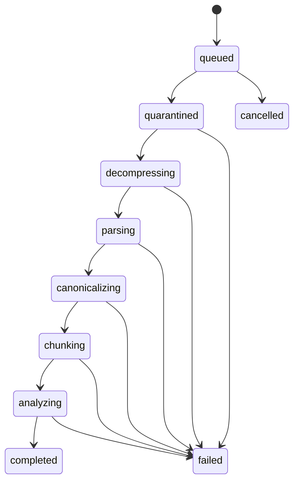
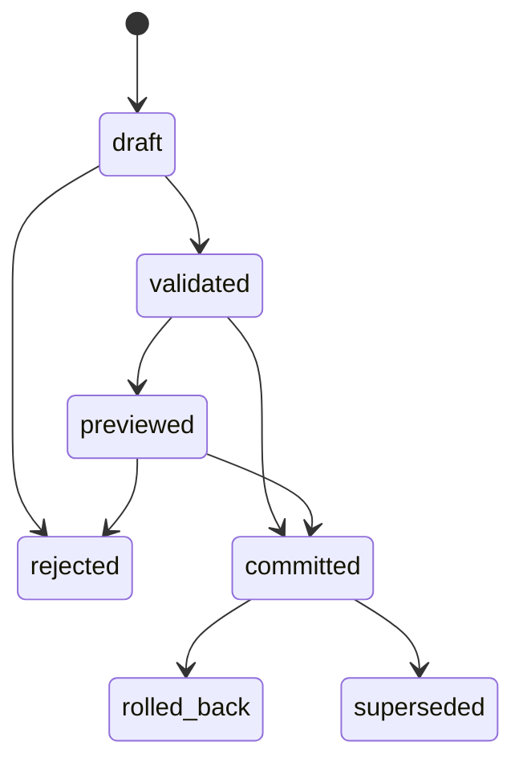
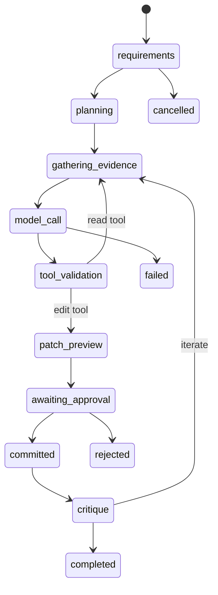

# Required initial architecture output

## 1. Architecture summary

A modular monorepo separates untrusted ingestion, canonical voxel data, content-addressed chunks, resource-model rendering, deterministic snapshots, analysis, patches, AI orchestration, and export. API requests create jobs; isolated workers perform expensive work. The same TypeScript renderer package serves the browser and headless renderer to prevent visual drift.

## 2. Technology stack and rationale

- React + strict TypeScript + Vite for a responsive editor and typed contracts.
- Three.js for instancing, orthographic/perspective cameras, render targets, clipping, and WebGL diagnostics.
- FastAPI + Pydantic for explicit HTTP boundaries and generated OpenAPI.
- Python core for format engineering, algorithms, orchestration, and broad testability.
- PostgreSQL for immutable metadata/version graphs; Redis + Celery for durable jobs; S3-compatible storage for uploads, chunks, snapshots, and exports.
- Node + Playwright for deterministic headless reuse of the browser renderer.
- Optional Rust only after benchmarks establish value.

## 3. Dependency boundaries

Rules: renderers depend on canonical contracts, never source formats; providers depend on AI protocol, never patch internals; parsers never call storage or HTTP; patch validation and application remain separate.

## 4. Canonical data model

`BuildDocument` stores source metadata, normalized bounds/origin, exact canonical palette entries, source regions, sparse canonical coordinates, block entities, entities, ticks, diagnostics, extension data, and deterministic content hash. 16×16×16 sections are encoded independently and referenced by immutable hashes.

## 5. Import job state machine

## 6. Patch state machine

## 7. AI-run state machine

## 8. Database entities

Users, workspaces, projects, builds, source files, build versions, chunk blobs, version manifests, regions, palettes, block entities, entities, analyses, snapshots, artifacts, patches, patch operations, providers, model profiles, AI runs, tool calls, exports, jobs, audit events, encrypted credentials, and retention policies.

## 9. API outline

The implemented and target routes follow `/api/v1`: uploads, import jobs, builds/versions, palette, chunks, blocks/query, regions/rooms/components/analysis, snapshots, patches, AI runs, and exports. Every expensive mutation accepts an idempotency key and returns a job or immutable resource identifier.

## 10. Security threat model

Primary threats: compression/NBT bombs, integer overflow, malicious ZIP paths/symlinks/duplicates, oversized JSON/model parent chains, cross-project access, stolen provider keys, prompt-generated invalid tool calls, renderer resource exhaustion, and signed-URL leakage. Controls: checked limits, streaming/quarantine, isolated workers, non-root/read-only containers, schema validation, authorization at every resource, server-side secrets, patch caps, audit logs, CSP/CORS, and content-addressed storage.

## 11. Testing strategy

Unit tests for every binary algorithm and coordinate transform; randomized/property tests for packing and round trips; fuzz targets for NBT, compression, palettes, ZIPs, and patch payloads; golden asymmetric fixtures; renderer semantic-map exact tests; screenshot presentation tolerances; integration and Playwright E2E flows; performance regression thresholds.

## 12. Phased checklist

The twelve phases and status are maintained in `IMPLEMENTATION_STATUS.md`. Every increment contains production code, tests, documentation, and a verification record.

## 13. Assumptions

- Canonical +X east, +Y up, +Z south.
- Flattened overlapping Litematic view uses sorted-region-name last-write while preserving source regions.
- Legacy auto mapping is conservative; unresolved numeric values are not silently replaced.
- User-supplied vanilla assets are local and are never redistributed.
- Heuristic room/lighting/navigation findings are labeled as approximations unless an exact game-engine adapter is used.

## 14. High-risk areas

Legacy flattening ambiguity, Litematic dialect/version changes, blockstate/model fidelity, transparency and fluids, special block entities, huge-build memory behavior, deterministic GPU presentation rendering, exact navigation collision shapes, AI tool safety, multi-region export, and resource-pack licensing.

## 15. Facts requiring upstream revalidation

Before each release: Sponge schema/version details, Litematica packed-array and metadata behavior, current Minecraft resource JSON semantics, DataVersion/block registry mappings, current usage/branding rules, provider API limits and retention, FastAPI/Celery/PostgreSQL/Redis compatibility, Node/browser/Three.js versions, Playwright Chromium behavior, and current container/Kubernetes security guidance.
