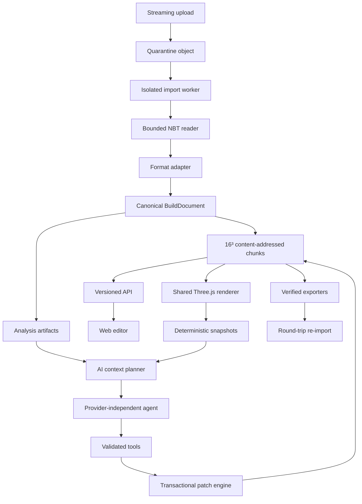

# Architecture overview

```mermaid
flowchart TB
  Upload[Streaming upload] --> Quarantine[Quarantine object]
  Quarantine --> Worker[Isolated import worker]
  Worker --> NBT[Bounded NBT reader]
  NBT --> Adapter[Format adapter]
  Adapter --> Canonical[Canonical BuildDocument]
  Canonical --> Chunks[16³ content-addressed chunks]
  Canonical --> Analysis[Analysis artifacts]
  Chunks --> API[Versioned API]
  API --> Web[Web editor]
  Chunks --> Renderer[Shared Three.js renderer]
  Renderer --> Snapshot[Deterministic snapshots]
  Analysis --> Context[AI context planner]
  Snapshot --> Context
  Context --> Agent[Provider-independent agent]
  Agent --> Tools[Validated tools]
  Tools --> Patch[Transactional patch engine]
  Patch --> Chunks
  Chunks --> Export[Verified exporters]
  Export --> Reimport[Round-trip re-import]
```

See `initial-output.md` for states, boundaries, assumptions, and risk register.
